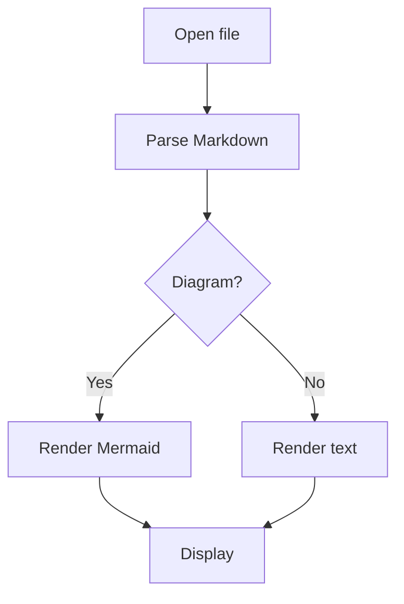

# Markdown Viewer sample

## Mathematics

Inline: $E = mc^2$.

$$
\int_0^1 x^2 \, dx = \frac{1}{3}
$$

Also: \(a^2+b^2=c^2\) and \[e^{i\pi}+1=0\].

## Mermaid

```mermaid
flowchart TD
    A["Open file"] --> B["Parse Markdown"]
    B --> C{"Diagram?"}
    C -->|Yes| D["Render Mermaid"]
    C -->|No| E["Render text"]
    D --> F["Display"]
    E --> F
```
